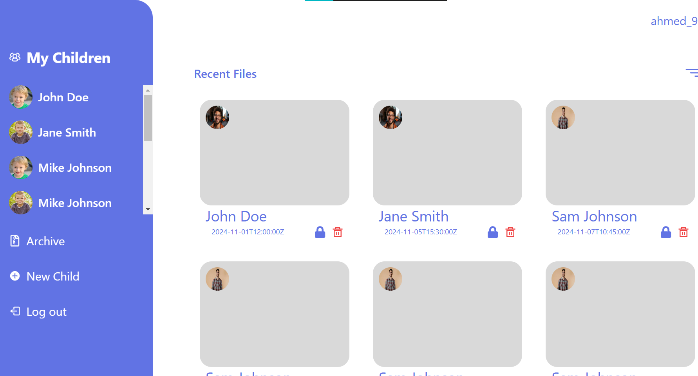
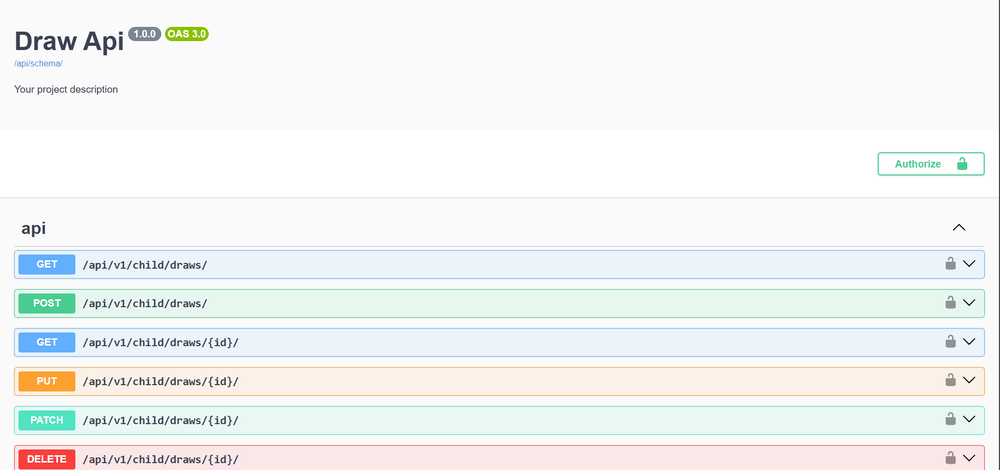
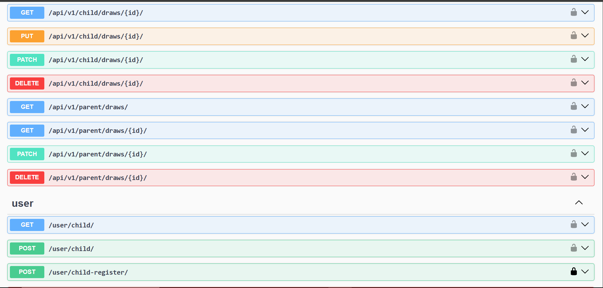
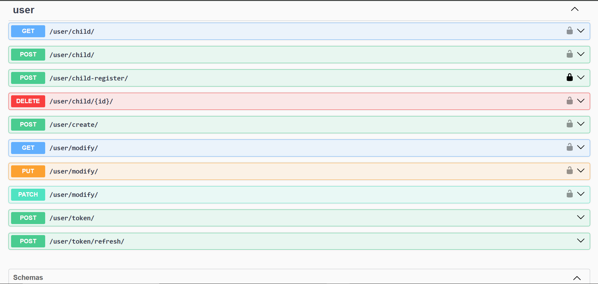

# Educational Site for Learning Shapes and Colors

## Project Overview
This project is an educational web application designed to help children learn shapes and colors in a fun and interactive way and make their parents to control them. The website allows children to create and manipulate drawings with various shapes, helping them develop their creativity and understanding of geometric forms.

## Features

### For Children
- **Create New Drawings**: Children can start a new drawing or open an existing one to continue their work.
- **Add Shapes**: Within each drawing, children can add different shapes, including:
  - Rectangle
  - Ellipse
  - Line
- **Special Shape (Frame)**: Each drawing contains a special shape known as the "frame" that holds all other shapes.
- **Erase Drawings**: When a child deletes a drawing, all shapes are removed except for the frame, which remains.

### For Parents
- **View Drawings**: Parents can view their child's drawings.
- **Lock Drawings**: Parents have the ability to lock drawings, making them non-editable.
- **Archive Drawings**: Drawings can be archived for future reference.
- **Auto-Cleanup**: Archived drawings older than six months are automatically deleted to maintain a clean and organized space.

## Some ScreenShots

